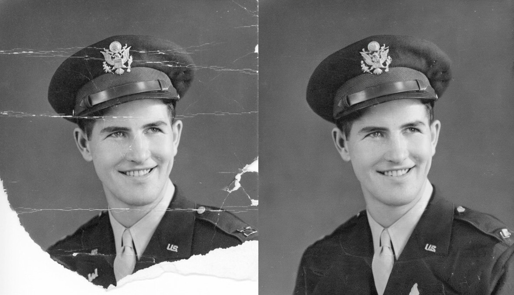

# UnpromptedControl

**By sponsoring me, you're not just supporting my work - you're helping to create a more collaborative, innovative open source community 💖 [sponsor](https://github.com/sponsors/vijishmadhavan?o=sd&sc=t).**

[Get more updates on Twitter](https://twitter.com/Vijish68859437)

ControlNet is a highly regarded tool for guiding StableDiffusion models, and it has been widely acknowledged for its effectiveness. In this repository, A simple hack that allows for the restoration or removal of objects without requiring user prompts. By leveraging this approach, the workflow can be significantly streamlined, leading to enhanced process efficiency.

## No-prompt

## Image Restoration 

In this image restoration is accomplished using the controlnet-canny and stable-diffusion-2-inpainting techniques, with only "" blank input prompts. Additionally, for automatic scratch segmentation, the FT_Epoch_latest.pt model is being used. However, if the segmentation output is not satisfactory, it is possible to manually sketch and refine the mask to achieve better results. As ControlNet model is trained on pairs of images, one of which has missing parts, and it learns to predict the missing parts based on the content of the complete image.

## Object Removal

Automatically removing objects from images is a challenging task that requires a combination of computer vision and deep learning techniques. This code leverages the power of OpenCV inpainting, deep learning-based image restoration, and blending techniques to achieve this task automatically, without the need for user prompts. The ControlNetModel and StableDiffusionInpaintPipeline models play a crucial role in guiding the inpainting process and restoring the image to a more natural-looking state. Overall, this code provides an efficient and effective way to remove unwanted objects from images and produce natural-looking results that are consistent with the surrounding image content. 

**"Surely, it has its limitations and might fail with certain images, especially those of faces, and may require some back and forth. To obtain good results, we need to mask not only the object but also its shadow."**

